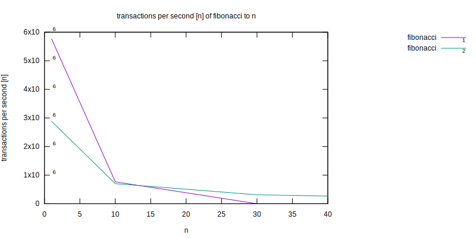
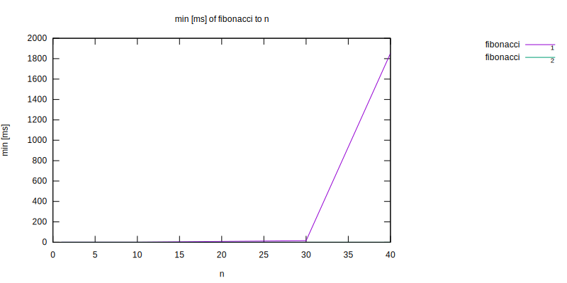
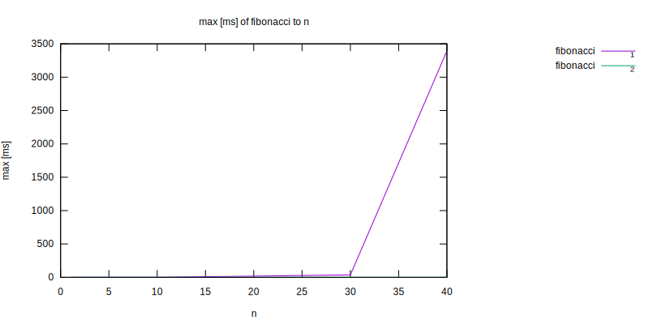
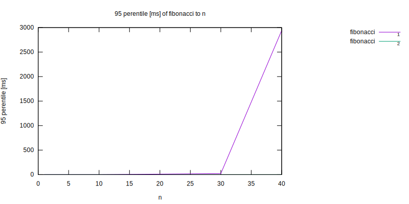

[](https://travis-ci.org/jpospychala/perf-lane)

# perf-lane

Performance testing harness for Node.js

Main features:

- performance test as code, resembling unit tests
- compare performance for different input sizes

# Examples

```js
const test = require('perf-lane')
const assert = require('assert')

test.for_n([
  [1, 1],
  [10, 55],
  [30, 832040],
  [40, 102334155]
])

test('fibonacci_1', (p) => {
  function fibonacci_1(n) {
    return n < 1  ? 0
         : n <= 2 ? 1
         : fibonacci_1(n - 1) + fibonacci_1(n - 2)
  }

  let actual = fibonacci_1(p.n)
  assert.equal(actual, p.expected, `fibonacci(${p.n})`)
})

test('fibonacci_2', (p) => {
  const cache = [0, 1, 1]
  function fibonacci_2(n) {
    cache[n] = cache[n] || fibonacci_2(n - 1) + fibonacci_2(n - 2)
    return cache[n]
  }

  let actual = fibonacci_2(p.n)
  assert.equal(actual, p.expected, `fibonacci(${p.n})`)
})

```

```bash
$ perf-lane fibonacci.perf.js
'fibonacci fibonacci_1' for n=1 takes 0-1ms p(95)=0ms tps=6521739 (150000 runs)
'fibonacci fibonacci_1' for n=10 takes 0-1ms p(95)=0ms tps=852273 (150000 runs)
'fibonacci fibonacci_1' for n=30 takes 15-22ms p(95)=15ms tps=65 (978 runs)
'fibonacci fibonacci_1' for n=40 takes 1864-1951ms p(95)=1864ms tps=1 (30 runs)
'fibonacci fibonacci_2' for n=1 takes 0-1ms p(95)=0ms tps=3061224 (150000 runs)
'fibonacci fibonacci_2' for n=10 takes 0-1ms p(95)=0ms tps=688073 (150000 runs)
'fibonacci fibonacci_2' for n=30 takes 0-2ms p(95)=0ms tps=327511 (150000 runs)
'fibonacci fibonacci_2' for n=40 takes 0-1ms p(95)=0ms tps=274725 (150000 runs)
```









# Documentation

`test(title: string, fn: (p) => {})` - declare test function with given title.

Test is either sync or returns Promise.

`p` Attributes:

- `p.n` - current `n` of declared `for_n`
- `p.expected` - current `expected` of declared `for_n`
- `p.i` - test invokation counter, starts from 0 for each `n`
- `p.name` - test file name
- `p.test` - test title


`test.async(title: string, fn: (p) => {})` - declare async test function, that terminates by calling `end` callback.

`p` Attributes: see `test(title, fn)`, additionally:

- `p.end` - callback to be called on test end

`test.for_n(array)` - declare list of `[n, expected]` pairs for which test will be invoked.

Use it to test performance for different problem sizes,
use `expected` in assertions to make sure tested code is
not only fast but also correct.

`test.beforeEach(fn)` - declare function to be called before each test function invocation

`test.afterEach(fn)` - declare function to be called after each test function invocation

`test.before(fn)` - declare function to be called before invoking any tests in a test file

`test.after(fn)` - declare function to be called after invoking all tests in a test file

`test.run()` - runs tests, equivalent to running `perf-lane` from command line.

`test.loggers` - list of default available loggers

`test.options` - Available options

- `transactionsPerTest` - number of transactions per test, to properly calculate TPS
- `minSecs` - minimum time period to repeat single test
- `maxSecs` - maximum time period to repeat single test
- `minRuns` - minimum numer of single test invocations
- `maxRuns` - maximum number of single test invocations
- `logger` - logger function
- `report` - report generator function
- `format` - report charts, `svg` or `png`
- `outFile` - report log output file
- `envName` - environment name, defaults to `process.env.HOSTNAME` or `process.env.TEST_ENV`
